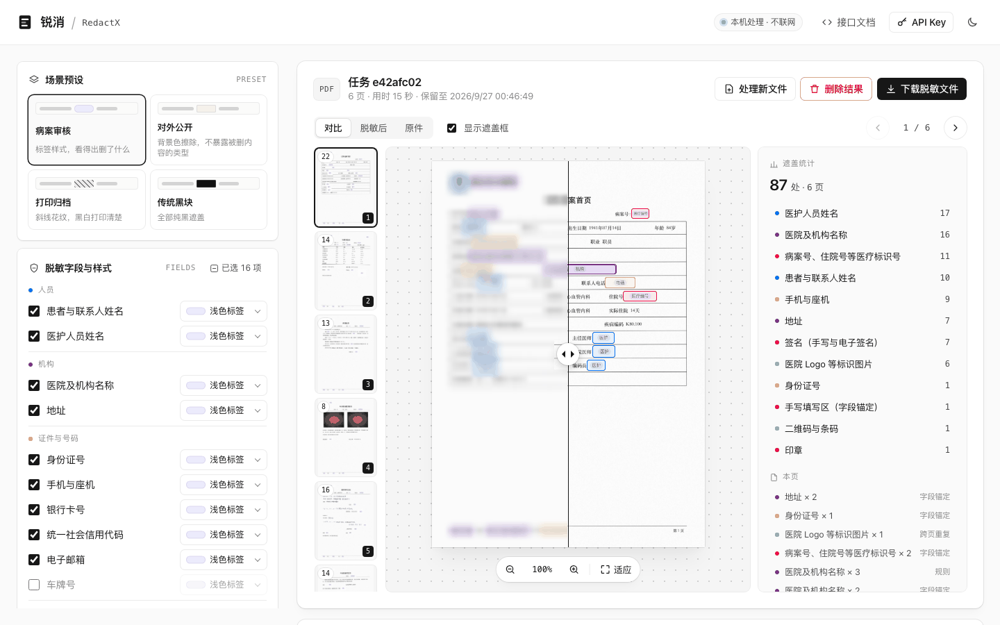
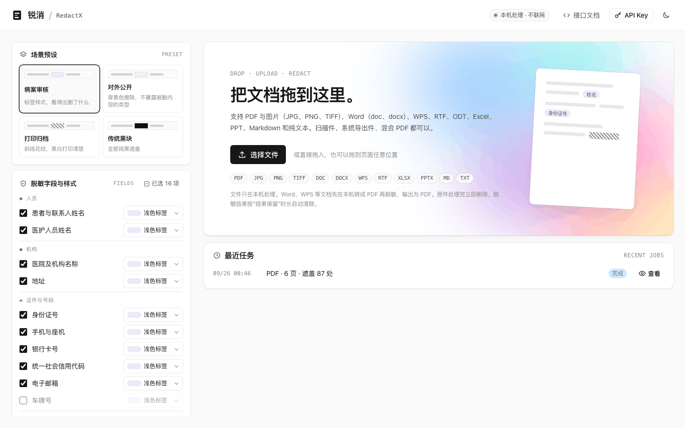
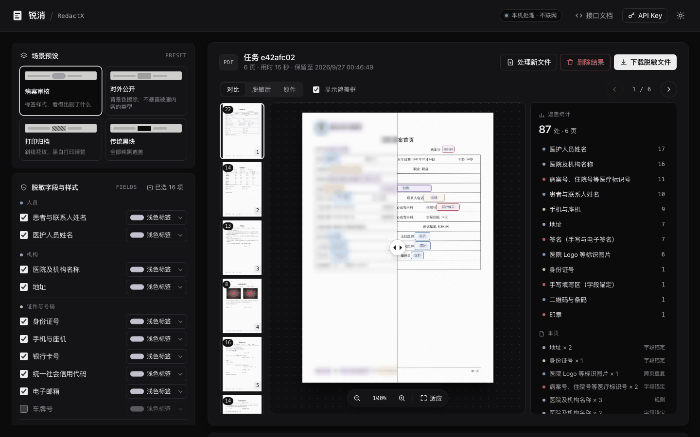

# 锐消 RedactX

[](LICENSE)

病案等文档的本地脱敏服务。上传 PDF 或图片，自动识别患者与医护人员姓名、医院名称、证件号、电话、病案号、手写填写区、签名、印章等内容，按指定样式打码，输出栅格化重建后的 PDF。

- 全部在本机处理，不调用任何外部模型或云端接口。
- 日期一律不遮盖（含出生日期、入出院日期、手写日期）。
- 上传的原文件处理完立即删除；脱敏结果、预览图（含供对比查看的原件缩小版，宽度不超过 1400 像素）按保留时长（默认 24 小时）自动清除，也可随时手动删除。



<details>
<summary>更多截图：上传页、深色主题</summary>





</details>

截图中的病案为评估集生成的合成数据，姓名、机构、号码均为虚构。

## 运行

### 方式一：本机直接运行（开发）

```bash
uv venv .venv --python 3.12
uv pip install --python .venv/bin/python -e ".[dev]"
# 可选：正文人名识别模型（一次性联网下载并导出，约 100 MB，写入 models/ner/）
uv pip install --python .venv/bin/python -e ".[ner-export]" && .venv/bin/python deploy/ner_export.py
.venv/bin/uvicorn service.app:app --host 127.0.0.1 --port 8000
```

打开 http://127.0.0.1:8000 。

### 方式二：Apple container

```bash
deploy/container/run.sh          # 默认端口 8090、容器名 redactx-oss；也可 run.sh <端口>
```

首次运行会构建镜像（需要下载 Python 基础镜像与依赖，一次性）。

开发时不必每次重建镜像：

```bash
deploy/container/dev.sh              # 用已有镜像的运行环境，挂载仓库里的代码、页面与模型，改动即时生效
deploy/container/dev.sh --rebuild    # 依赖（pyproject.toml、Containerfile）变了时才需要
```

Python 代码改动后服务自动重启（正在处理的任务会中断），Web 页刷新浏览器即可。容器名与端口同 `run.sh`，两者互相替换；最终部署用 `run.sh` 按版本号生成镜像。构建前须先按方式一导出正文人名识别模型到 `models/ner/`，镜像会把它一并打包。数据目录挂载在 `data-container/`，服务只绑定 127.0.0.1。

## 接口

| 方法 | 路径 | 说明 |
|---|---|---|
| POST | `/v1/jobs` | 提交异步任务：`file`（文件）、`options`（JSON 字符串）、`retention_hours`、`password` |
| GET | `/v1/jobs/{id}` | 查询状态与进度 |
| GET | `/v1/jobs/{id}/result` | 下载脱敏文件 |
| GET | `/v1/jobs/{id}/report` | 打码报告：页码、类型、来源、归一化坐标，不含原文 |
| GET | `/v1/jobs/{id}/preview/{page}?v=before\|after` | 预览图 |
| PUT | `/v1/jobs/{id}/review` | 提交复核后的全部遮盖框，重新打码受影响的页并重建输出 |
| POST | `/v1/jobs/{id}/review/finish` | 复核完成，删除为复核保留的打码前页面 |
| DELETE | `/v1/jobs/{id}` | 立即删除结果与预览 |
| POST | `/v1/redact` | 同步脱敏，限 10 页、20 MB，直接返回文件 |
| GET | `/v1/catalog` | 实体类型、样式、预设 |

`options` 示例：

```json
{
  "entities": ["PERSON", "STAFF", "ORG", "ID_CARD", "PHONE", "MEDICAL_ID", "HANDWRITTEN_FIELD", "SIGNATURE", "SEAL", "LOGO"],
  "default_style": "label",
  "styles": {"SIGNATURE": "hatch", "SEAL": "background"},
  "custom_words": ["某某医院东院区"],
  "mode": "strict",
  "label_text": "type",
  "dpi": 200,
  "verify": "auto",
  "keep_source": false
}
```

样式：`label` 浅色标签、`background` 背景色擦除、`replace` 代号替换、`mosaic` 安全马赛克、`hatch` 斜线花纹、`inpaint` 图像修复、`black` 黑色块。所有样式都先擦除原像素再绘制外观。

**复核**：在 Web 页查看结果时点“复核”，可以在页面上拖出新框补遮漏掉的内容，保存后重新打码并重建输出。默认不保留全尺寸的打码前页面，已打码的像素无法恢复，所以只能加框。提交时打开“保留原件以便复核”（`keep_source`），会另存打码前的页面，复核时还可以删框、改框；点“完成复核”或任务到期时删除。

设置环境变量 `REDACTX_API_KEY` 后，所有 `/v1` 接口需要请求头 `X-API-Key`。

## 配置

| 变量 | 默认 | 说明 |
|---|---|---|
| `REDACTX_DATA` | `data` | 数据目录 |
| `REDACTX_DPI` | `200` | 默认渲染分辨率 |
| `REDACTX_RETENTION_HOURS` | `24` | 结果默认保留时长 |
| `REDACTX_WORKERS` | `1` | 并行任务数（16 GB 内存建议 1） |
| `REDACTX_MAX_UPLOAD_MB` | `200` | 上传上限 |
| `REDACTX_API_KEY` | 无 | 设置后启用 API Key 校验 |

## 目录

```
redactx/          识别与打码引擎
  ingest.py       文件校验、整页渲染、文字层与图片对象
  ocr.py          PP-OCRv6（RapidOCR / ONNX Runtime），单字坐标、整页方向纠正
  detect/         规则与校验位、字段锚定、词表、文档内实体传播
  vision.py       红章、二维码条码、填写区笔迹、图片对象归类
  redact.py       打码样式引擎（先擦除、后装饰）
  pipeline.py     两遍处理流水线与栅格化重建
service/          FastAPI 接口与任务管理
web/              Web 页（纯静态，不加载外部资源）
deploy/container/ Apple container 镜像与启动脚本
tests/            单元测试（全部使用虚构数据）
bench/            合成评估集：生成虚构病案并统计遮全率、误遮、耗时与性能
```

## 评估

`bench/` 生成全部为虚构数据的合成病案，并在上面跑完整流水线打分。需要 macOS 自带的中文字体（其他系统可用 `REDACTX_BENCH_FONT` 指定一个 TrueType 中文字体）。

```bash
uv pip install --python .venv/bin/python -e ".[dev,bench]"
.venv/bin/python -m bench.make --out bench/out --cases 3      # 生成：每种形态 3 份，每份 4 页
.venv/bin/python -m bench.evaluate --data bench/out            # 评估：结果写入 bench/out/results/
.venv/bin/python -m bench.prose                                 # 正文人名（纯文本）：遮全率与误遮
.venv/bin/python -m bench.show bench/out/docs/scan-001.pdf --page 1 --out page1.png   # 查看标准答案框
```

十一种形态（`harsh`、`photo` 为加难形态，见下）：`text` 系统导出（文字层、电子签名小图、跨页重复 Logo），`textwm` 系统导出加文字层院名水印，`scan` 白纸扫描 200 DPI（手写姓名与签名、红章压字、轻微歪斜），`kraft` 牛皮纸扫描 300 DPI，`rotated` 横放扫描（内容旋转 90°），`mixed` 文字层页与扫描页混排，`hard` 扫描件加淡粉色印章、平铺斜向水印与大号连笔签名，`mrc` 复印机 MRC 分层压缩。扫描类形态另有一页手写日常病程（手写日期与诊断、各种写法的医师签名）。加难形态：`harsh` 150 DPI 低质量扫描（重噪点、模糊、强 JPEG 压缩、歪斜可达 2.5°），`photo` 手机拍照（透视变形、不均匀光照与阴影）；两者另有第 7 页护理记录单（表格格子里的护士签名、一格两人签名、手写记录里的家属姓名、压在签名上的科室章）。
标准答案分“应遮”（姓名、医护、机构、证件号、电话、医疗标识号、地址、签名、印章、Logo、二维码，以及只在正文出现的人名）与“应留”（日期、诊断与编码、检验结果、性别、年龄、费用、临床照片）。
指标：应遮项被覆盖 ≥ 80% 记为遮全；应留项被覆盖超过 15% 记为误遮；与任何应遮项都不重叠的遮盖区域记为多遮。

## 性能

`bench/perf.py` 用合成病案拼出约 100 页的文档，每份在独立进程中处理，测总耗时、每页耗时、首页耗时（含模型加载）与内存峰值：

```bash
.venv/bin/python -m bench.perf --out bench/perf --pages 100   # 结果写入 bench/perf/perf.md
```

Apple M4、16 GB，本机直接运行（纯 CPU，默认选项：扫描页做出厂自检，文字层页不做）：

| 文档 | 页数 | 总耗时 | 每页 | 首页 | 内存峰值 |
|---|---|---|---|---|---|
| 系统导出（文字层） | 100 | 18 秒 | 0.18 秒 | 0.6 秒 | 1.4 GB |
| 白纸扫描 200 DPI（含手写页） | 102 | 261 秒 | 2.6 秒 | 1.6 秒 | 1.9 GB |

关闭自检时扫描件约 1.5 秒/页；文字层全部页自检约 1.2 秒/页。验收目标（容器内 6 核 6 GB 同样适用）：

| 指标 | 文字层 | 扫描件 |
|---|---|---|
| 每页 | ≤ 0.5 秒 | ≤ 3 秒 |
| 100 页文档 | ≤ 1 分钟 | ≤ 5 分钟 |
| 首页出结果 | ≤ 5 秒 | ≤ 5 秒 |
| 内存峰值 | ≤ 4 GB | ≤ 4 GB |

## 第三方模型

- 文字识别：RapidOCR 随包附带的 PP-OCR 模型（Apache-2.0）。
- 正文人名识别：[shibing624/bert4ner-base-chinese](https://huggingface.co/shibing624/bert4ner-base-chinese)（Apache-2.0），由 `deploy/ner_export.py` 固定版本下载、导出为 ONNX 并做 int8 量化，运行时只用 onnxruntime 与 tokenizers，不联网。未导出模型时该功能自动关闭，其余功能不受影响。

## 已知限制

- 正文人名识别（NER）用通用语料（人民日报等）训练的模型，未在病历语料上微调；少见姓氏（如“向”“万”“付”）的人名偶有漏识别。只有姓氏的称呼（“李主任”）不遮。
- 压在照片等彩色图像上的水印分不出来，不会消除。
- 手写签名靠字段标签、日期位置与笔画连通来定位，没有专门的签名检测模型；既无标签、又不在日期后面的签名可能漏遮。

## 参与贡献

欢迎提交 issue 和 PR，请先阅读 [CONTRIBUTING.md](CONTRIBUTING.md)。**任何情况下都不要在仓库、issue 或 PR 中附带真实病案或个人信息。** 安全问题请按 [SECURITY.md](SECURITY.md) 私下报告。

## 许可证

[Apache License 2.0](LICENSE)。第三方组件许可证见 [THIRD_PARTY_LICENSES.md](THIRD_PARTY_LICENSES.md)。
